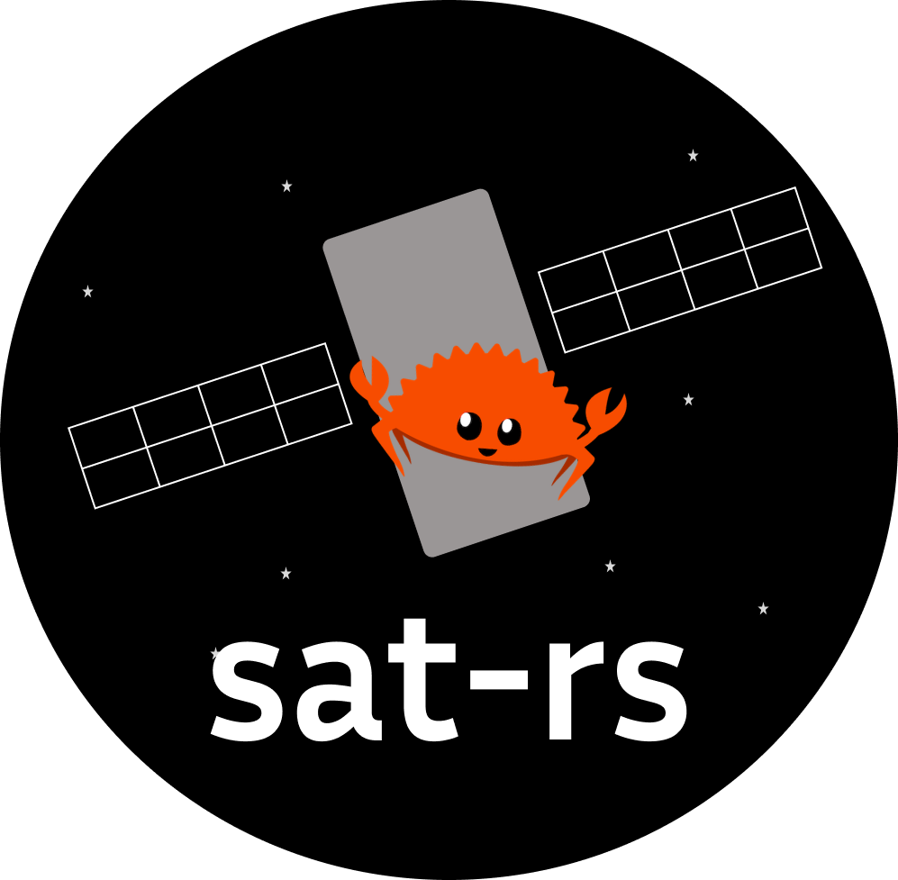

<p align="center">  </p>

sat-rs
=========

This is the repository of the sat-rs framework. Its primary goal is to provide re-usable components
to write on-board software for remote systems like rovers or satellites. It is specifically written
for the special requirements for these systems. You can find an overview of the project and the
link to the [more high-level sat-rs book](https://absatsw.irs.uni-stuttgart.de/projects/sat-rs/)
at the [IRS software projects website](https://absatsw.irs.uni-stuttgart.de/projects/sat-rs/).

A lot of the architecture and general design considerations are based on the
[FSFW](https://egit.irs.uni-stuttgart.de/fsfw/fsfw) C++ framework which has flight heritage
through the 2 missions [FLP](https://www.irs.uni-stuttgart.de/en/research/satellitetechnology-and-instruments/smallsatelliteprogram/flying-laptop/)
and [EIVE](https://www.irs.uni-stuttgart.de/en/research/satellitetechnology-and-instruments/smallsatelliteprogram/EIVE/).

# Overview

This project currently contains following crates:

* [`satrs-book`](https://egit.irs.uni-stuttgart.de/rust/sat-rs/src/branch/main/satrs-book):
   Primary information resource in addition to the API documentation, hosted
   [here](https://documentation.irs.uni-stuttgart.de/projects/sat-rs/). It can be useful to read
   this first before delving into the example application and the API documentation.
* [`satrs`](https://egit.irs.uni-stuttgart.de/rust/sat-rs/src/branch/main/satrs):
   Primary crate.
* [`satrs-example`](https://egit.irs.uni-stuttgart.de/rust/sat-rs/src/branch/main/satrs-example):
   Example of a simple example on-board software using various sat-rs components which can be run
   on a host computer or on any system with a standard runtime like a Raspberry Pi.
* [`satrs-mib`](https://egit.irs.uni-stuttgart.de/rust/sat-rs/src/branch/main/satrs-mib):
   Components to build a mission information base from the on-board software directly.
* [`satrs-example-stm32f3-disco`](https://egit.irs.uni-stuttgart.de/rust/sat-rs/src/branch/main/satrs-example-stm32f3-disco):
   Example of a simple example on-board software using sat-rs components on a bare-metal system
   with constrained resources.

Each project has its own `CHANGELOG.md`.

# Related projects
 
 In addition to the crates in this repository, the sat-rs project also maintains other libraries.

 * [`spacepackets`](https://egit.irs.uni-stuttgart.de/rust/spacepackets): Basic ECSS and CCSDS
   packet protocol implementations. This repository is re-exported in the
   [`satrs`](https://egit.irs.uni-stuttgart.de/rust/satrs/src/branch/main/satrs)
   crate.

# Coverage

Coverage was generated using [`grcov`](https://github.com/mozilla/grcov). If you have not done so
already, install the `llvm-tools-preview`:

```sh
rustup component add llvm-tools-preview
cargo install grcov --locked
```

After that, you can simply run `coverage.py` to test the `satrs-core` crate with coverage. You can
optionally supply the `--open` flag to open the coverage report in your webbrowser.
