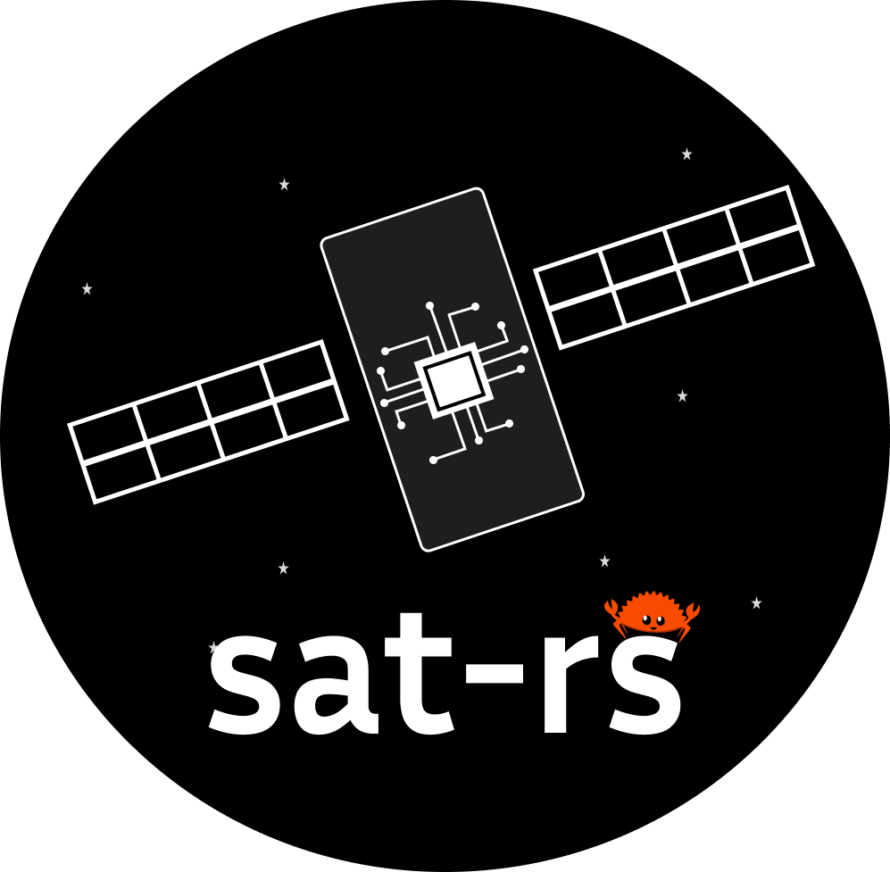

<p align="center">  </p>

[](https://absatsw.irs.uni-stuttgart.de/projects/sat-rs/)
[](https://absatsw.irs.uni-stuttgart.de/projects/sat-rs/book/)
[](https://crates.io/crates/satrs)
[](https://docs.rs/satrs)

sat-rs
=========

This is the repository of the sat-rs library. Its primary goal is to provide re-usable components
to write on-board software for remote systems like rovers or satellites. It is specifically written
for the special requirements for these systems. You can find an overview of the project and the
link to the [more high-level sat-rs book](https://absatsw.irs.uni-stuttgart.de/projects/sat-rs/)
at the [IRS software projects website](https://absatsw.irs.uni-stuttgart.de/projects/sat-rs/).

This is early-stage software. Important features are missing. New releases
with breaking changes are released regularly, with all changes documented inside respective
changelog files. You should only use this library if your are willing to work in this
environment.

A lot of the architecture and general design considerations are based on the
[FSFW](https://egit.irs.uni-stuttgart.de/fsfw/fsfw) C++ framework which has flight heritage
through the 2 missions [FLP](https://www.irs.uni-stuttgart.de/en/research/satellitetechnology-and-instruments/smallsatelliteprogram/flying-laptop/)
and [EIVE](https://www.irs.uni-stuttgart.de/en/research/satellitetechnology-and-instruments/smallsatelliteprogram/EIVE/).

# Overview

This project currently contains following crates:

* [`satrs-book`](https://egit.irs.uni-stuttgart.de/rust/sat-rs/src/branch/main/satrs-book):
   Primary information resource in addition to the API documentation, hosted
   [here](https://documentation.irs.uni-stuttgart.de/projects/sat-rs/). It can be useful to read
   this first before delving into the example application and the API documentation.
* [`satrs`](https://egit.irs.uni-stuttgart.de/rust/sat-rs/src/branch/main/satrs):
   Primary crate.
* [`satrs-example`](https://egit.irs.uni-stuttgart.de/rust/sat-rs/src/branch/main/satrs-example):
   Example of a simple example on-board software using various sat-rs components which can be run
   on a host computer or on any system with a standard runtime like a Raspberry Pi.
* [`satrs-mib`](https://egit.irs.uni-stuttgart.de/rust/sat-rs/src/branch/main/satrs-mib):
   Components to build a mission information base from the on-board software directly.
* [`satrs-stm32f3-disco-rtic`](https://egit.irs.uni-stuttgart.de/rust/sat-rs/src/branch/main/embedded-examples/satrs-stm32f3-disco-rtic):
   Example of a simple example using low-level sat-rs components on a bare-metal system
   with constrained resources. This example uses the [RTIC](https://github.com/rtic-rs/rtic)
   framework on the STM32F3-Discovery device.
* [`satrs-stm32h743zit-rtic`](https://egit.irs.uni-stuttgart.de/rust/sat-rs/src/branch/main/embedded-examples/satrs-stm32h743zit-rtic):
   Example of a simple example using sat-rs components on a bare-metal system
   with constrained resources. This example uses the [RTIC](https://github.com/rtic-rs/rtic)
   framework on the STM32H743ZIT device.

Each project has its own `CHANGELOG.md`.

# Related projects

 In addition to the crates in this repository, the sat-rs project also maintains other libraries.

 * [`spacepackets`](https://egit.irs.uni-stuttgart.de/rust/spacepackets): Basic ECSS and CCSDS
   packet protocol implementations. This repository is re-exported in the
   [`satrs`](https://egit.irs.uni-stuttgart.de/rust/satrs/src/branch/main/satrs)
   crate.

# Flight Heritage

There is an active and continuous effort to get early flight heritage for the sat-rs library.
Currently this library has the following flight heritage:

- Submission as an [OPS-SAT experiment](https://www.esa.int/Enabling_Support/Operations/OPS-SAT)
  which has also
  [flown on the satellite](https://blogs.esa.int/rocketscience/2024/05/21/ops-sat-reentry-tomorrow-final-experiments-continue/).
  The application is strongly based on the sat-rs example application. You can find the repository
  of the experiment [here](https://egit.irs.uni-stuttgart.de/rust/ops-sat-rs).

# Coverage

Coverage was generated using [`grcov`](https://github.com/mozilla/grcov). If you have not done so
already, install the `llvm-tools-preview`:

```sh
rustup component add llvm-tools-preview
cargo install grcov --locked
```

After that, you can simply run `coverage.py` to test the `satrs` crate with coverage. You can
optionally supply the `--open` flag to open the coverage report in your webbrowser.
