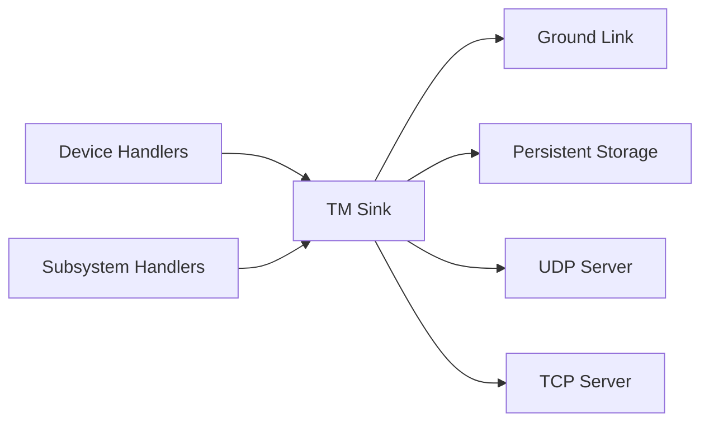
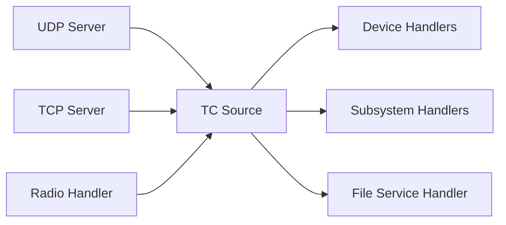

# Communication with sat-rs based software

Communication is a vital topic for remote system which are usually not (directly)
connected to the internet and only have 1-2 communication links during nominal operation. However,
most of these systems have internet access during development cycle. There are various standards
provided by CCSDS and ECSS which can be useful to determine how to communicate with the satellite
and the primary On-Board Software.

Most communication with space systems is usually packet based. For example, the CCSDS space
packet standard only specifies a 6 byte header with at least 1 byte payload. The `sat-rs` library
provides some support for the [CCSDS space packet protocol](https://ccsds.org/Pubs/133x0b2e2.pdf).

1. [UDP TMTC Server](https://docs.rs/satrs/latest/satrs/hal/std/udp_server/index.html).
   UDP is already packet based which makes it an excellent fit for exchanging space packets.
2. [TCP TMTC Server Components](https://docs.rs/satrs/latest/satrs/hal/std/tcp_server/index.html).
   TCP is a stream based protocol, so the library provides building blocks to parse telemetry
   from an arbitrary bytestream. Two concrete implementations are provided:
    - [TCP spacepackets server](https://docs.rs/satrs/latest/satrs/hal/std/tcp_server/struct.TcpSpacepacketsServer.html)
      to parse tightly packed CCSDS Spacepackets.
    - [TCP COBS server](https://docs.rs/satrs/latest/satrs/hal/std/tcp_server/struct.TcpTmtcInCobsServer.html)
      to parse generic frames wrapped with the
      [COBS protocol](https://en.wikipedia.org/wiki/Consistent_Overhead_Byte_Stuffing).

# Working with telemetry and telecommands (TMTC)

The commands sent to a space system are commonly called telecommands (TC) while the data received
from it are called telemetry (TM). One way to model the packet handling is to introduce the concept
of a TC source and a TM sink can be applied to most satellites. The TM sink is the one entity where
all generated telemetry arrives in real-time. The most important task of the TM sink usually is to
send all arriving telemetry to the ground segment of a satellite mission immediately.

Another important task might be to store all arriving telemetry persistently. This is especially
important for space systems which do not have permanent contact like low-earth-orbit (LEO)
satellites.

The diagram below shows one concrete example of how this could look like.

The most important task of a TC source is to deliver the telecommands to the correct recipients.
For component oriented software using message passing, this usually includes demultiplexing
to determine where a command needs to be sent.

The diagram below shows one concrete example of how this could look like.

Using a generic concept of a TC source and a TM sink as part of the software design simplifies
the flexibility of the TMTC infrastructure: Newly added TM generators and TC receiver only have to
forward their generated or received packets to those handler objects.

# Packet format

We talked about some basic support for the CCSDS space packet protocol. This is a really simple
protocol which just specifies a header that every exchanged TMTC packet has:

This is a protocol which already provides us with some useful fields:

- ID field provided by the Application Process Identifier (APID). This can also be useful for packet
  multiplexing
- Basic sequence counter which can be used to determine missed packets

However, how does the actual payload that we want to send to or from the satellite actually look
like? We recommend a payload format which is created with the excellent [`serde`](https://serde.rs/)
library. The [TMTC modelling](./tmtc-modelling.md) chapter provides more information.

# Low-level protocols and the bridge to the communcation subsystem

Many satellite systems usually use the lower levels of the OSI layer in addition to the application
layer. This oftentimes requires special hardware like dedicated FPGAs to handle forward error
correction fast enough. `sat-rs`
might provide components to handle standard like the Unified Space Data Link Standard (USLP) in
software but most of the time the handling of communication is performed through custom
software and hardware. Still, connecting this custom software and hardware to `sat-rs` can mostly
be done by using the concept of TC sources and TM sinks mentioned previously.
