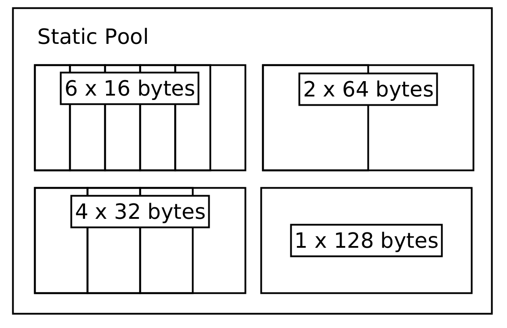

# Working with Constrained Systems

Software for space systems oftentimes has different requirements than the software for host
systems or servers. Currently, most space systems are considered embedded systems.

For these systems, the computation power and the available heap are the most important resources
which are constrained. This might make completeley heap based memory management schemes which
are oftentimes used on host and server based systems unfeasable. Still, completely forbidding
heap allocations might make software development unnecessarilly difficult, especially in a
time where the OBSW might be running on Linux based systems with hundreds of MBs of RAM.

A useful pattern used commonly in space systems is to limit heap allocations to program
initialization time and avoid frequent run-time allocations. This prevents issues like
running out of memory (something even Rust can not protect from) or heap fragmentation on systems
without a MMU.

# Using pre-allocated pool structures

A huge candidate for heap allocations is the TMTC and  handling. TC, TMs and IPC data are all
candidates where the data size might vary greatly. The regular solution for host systems
might be to send around this data as a `Vec<u8>` until it is dropped. `sat-rs` provides
another solution to avoid run-time allocations by offering pre-allocated static
pools. These pools are split into subpools where each subpool can have different page sizes.
For example, a very small telecommand (TC) pool might look like this:



The core of the pool abstractions is the
[PoolProvider trait](https://docs.rs/satrs/latest/satrs/pool/trait.PoolProvider.html).
This trait specifies the general API a pool structure should have without making assumption
of how the data is stored.

This trait is implemented by a static memory pool implementation.
The code to generate this static pool would look like this:

<!-- Would be nice to test this code sample, but need to wait
for https://github.com/rust-lang/mdBook/issues/706 to be merged.. -->
```rust, ignore
use satrs::pool::{StaticMemoryPool, StaticPoolConfig};

let tc_pool = StaticMemoryPool::new(StaticPoolConfig::new(vec![
    (6, 16),
    (4, 32),
    (2, 64),
    (1, 128)
]));
```

It should be noted that the buckets only show the maximum size of data being stored inside them.
The store will keep a separate structure to track the actual size of the data being stored.
A TC entry inside this pool has a store address which can then be sent around without having
to dynamically allocate memory. The same principle can also be applied to the telemetry (TM) and
inter-process communication (IPC) data.

You can read

- [`StaticPoolConfig` API](https://docs.rs/satrs/latest/satrs/pool/struct.StaticPoolConfig.html)
- [`StaticMemoryPool` API](https://docs.rs/satrs/latest/satrs/pool/struct.StaticMemoryPool.html)

for more details.

In the future, optimized pool structures which use standard containers or are
[`Sync`](https://doc.rust-lang.org/std/marker/trait.Sync.html) by default might be added as well.

# Using special crates to prevent smaller allocations

Another common way to use the heap on host systems is using containers like `String` and `Vec<u8>`
to work with data where the size is not known beforehand. The most common solution for embedded
systems is to determine the maximum expected size and then use a pre-allocated `u8` buffer and a
size variable. Alternatively, you can use the following crates for more convenience or a smart
behaviour which at the very least reduces heap allocations:

1. [`smallvec`](https://docs.rs/smallvec/latest/smallvec/).
2. [`arrayvec`](https://docs.rs/arrayvec/latest/arrayvec/index.html) which also contains an
   [`ArrayString`](https://docs.rs/arrayvec/latest/arrayvec/struct.ArrayString.html) helper type.
3. [`tinyvec`](https://docs.rs/tinyvec/latest/tinyvec/).

# Using a fixed amount of threads

On host systems, it is a common practice to dynamically spawn new threads to handle workloads.
On space systems this is generally considered an anti-pattern as this is considered undeterministic
and might lead to similar issues like when dynamically using the heap. For example, spawning a new
thread might use up the remaining heap of a system, leading to undeterministic errors.

The most common way to avoid this is to simply spawn all required threads at program initialization
time. If a thread is done with its task, it can go back to sleeping regularly, only occasionally
checking for new jobs. If a system still needs to handle bursty concurrent loads, another possible
way commonly used for host systems as well would be to use a threadpool, for example by using the
[`threadpool`](https://crates.io/crates/threadpool) crate.

