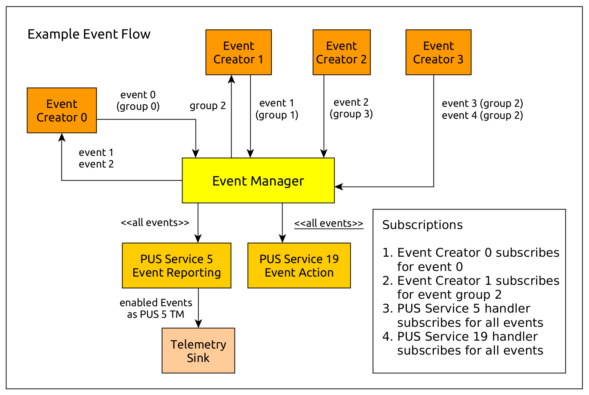

# Events

Events are an important mechanism used for remote systems to monitor unexpected
or expected anomalies and events occuring on these systems. 

One common use case for events on remote systems is to offer a light-weight publish-subscribe
mechanism and IPC mechanism for software and hardware events which are also packaged as telemetry
(TM) or can trigger a system response. They can also be tied to
Fault Detection, Isolation and Recovery (FDIR) operations, which need to happen autonomously.

The PUS Service 5 standardizes how the ground interface for events might look like, but does not
specify how other software components might react to those events. There is the PUS Service 19,
which might be used for that purpose, but the event components recommended by this framework do not
rely on the present of this service.

The following images shows how the flow of events could look like in a system where components
can generate events, and where other system components might be interested in those events:

