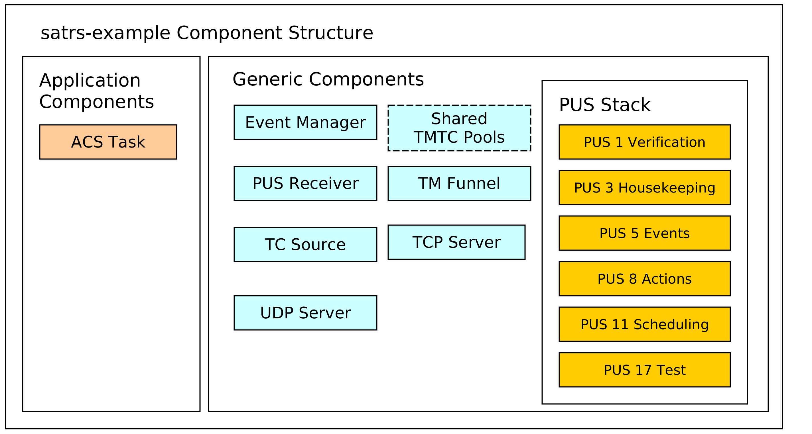
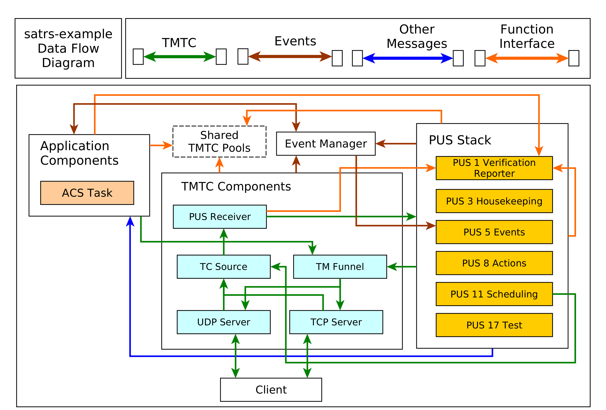

# sat-rs Example Application

The `sat-rs` framework includes a monolithic example application which can be found inside
the [`satrs-example`](https://egit.irs.uni-stuttgart.de/rust/sat-rs/src/branch/main/satrs-example)
subdirectory of the repository. The primary purpose of this example application is to show how
the various components of the sat-rs framework could be used as part of a larger on-board
software application.

## Structure of the example project

The example project contains components which could also be expected to be part of a production
On-Board Software. A structural diagram of the example application is given to provide
a brief high-level view of the components used inside the example application:

The dotted lines are used to denote optional components. In this case, the static pool components
are optional because the heap can be used as a simpler mechanism to store TMTC packets as well.
Some additional explanation is provided for the various components.

### TCP/IP server components

The example includes a UDP and TCP server to receive telecommands and poll telemetry from. This
might be an optional component for an OBSW which is only used during the development phase on
ground. The UDP server is strongly based on the
[UDP TC server](https://docs.rs/satrs/latest/satrs/hal/std/udp_server/struct.UdpTcServer.html).
This server component is wrapped by a TMTC server which handles all telemetry to the last connected
client.

The TCP server is based on the [TCP Spacepacket Server](https://docs.rs/satrs/latest/satrs/hal/std/tcp_server/struct.TcpSpacepacketsServer.html)
class. It parses space packets by using the CCSDS space packet ID as the packet
start delimiter. All available telemetry will be sent back to a client after having read all
telecommands from the client.

### TMTC Infrastructure

The most important components of the TMTC infrastructure include the following components:

- A TC source component which demultiplexes and routes telecommands based on parameters like
  packet APID or PUS service and subservice type.
- A TM sink sink component which is the target of all sent telemetry and sends it to downlink
   handlers like the UDP and TCP server.

You can read the [Communications chapter](./communication.md) for more
background information on the chosen TMTC infrastructure approach.

### PUS Service Components

A PUS service stack is provided which exposes some functionality conformant with the ECSS PUS
services. This currently includes the following services:

- Service 1 for telecommand verification. The verification handling is handled locally: Each
  component which generates verification telemetry in some shape or form receives a
  [reporter](https://docs.rs/satrs/latest/satrs/pus/verification/struct.VerificationReporterWithSender.html)
  object which can be used to send PUS 1 verification telemetry to the TM funnel.
- Service 3 for housekeeping telemetry handling.
- Service 5 for management and downlink of on-board events.
- Service 8 for handling on-board actions.
- Service 11 for scheduling telecommands to be released at a specific time. This component
  uses the [PUS scheduler class](https://docs.rs/satrs/latest/satrs/pus/scheduler/alloc_mod/struct.PusScheduler.html)
  which performs the core logic of scheduling telecommands. All telecommands released by the
  scheduler are sent to the central TC source using a message.
- Service 17 for test purposes like pings.

### Event Management Component

An event manager based on the sat-rs
[event manager component](https://docs.rs/satrs/latest/satrs/event_man/index.html)
is provided to handle the event IPC and FDIR mechanism. The event message are converted to PUS 5
telemetry by the
[PUS event dispatcher](https://docs.rs/satrs/latest/satrs/pus/event_man/alloc_mod/struct.PusEventDispatcher.html).

You can read the [events](./events.md) chapter for more in-depth information about event management.

### Sample Application Components

These components are example mission specific. They provide an idea how mission specific modules
would look like the sat-rs context. It currently includes the following components:

- An Attitute and Orbit Control (AOCS) example task which can also process some PUS commands.

## Dataflow

The interaction of the various components is provided in the following diagram:

It should be noted that an arrow coming out of a component group refers to multiple components
in that group. An explanation for important component groups will be given.

#### TMTC component group

This groups is the primary interface for clients to communicate with the on-board software
using a standardized TMTC protocol. The example uses the
[ECSS PUS protocol](https://ecss.nl/standard/ecss-e-st-70-41c-space-engineering-telemetry-and-telecommand-packet-utilization-15-april-2016/).
In the future, this might be extended with the
[CCSDS File Delivery Protocol](https://public.ccsds.org/Pubs/727x0b5.pdf).

A client can connect to the UDP or TCP server to send these PUS packets to the on-board software.
These servers then forward the telecommads to a centralized TC source component using a dedicated
message abstraction.

This TC source component then demultiplexes the message and forwards it to the relevant components.
Right now, it forwards all PUS requests to the respective PUS service handlers using the PUS
receiver component. The individual PUS services are running in a separate thread. In the future,
additional forwarding to components like a CFDP handler might be added as well. It should be noted
that PUS11 commands might contain other PUS commands which should be scheduled in the future.
These wrapped commands are forwarded to the PUS11 handler. When the schedule releases those
commands, it forwards the released commands to the TC source again. This allows the scheduler
and the TC source to run in separate threads and keeps them cleanly separated.

All telemetry generated by the on-board software is sent to a centralized TM funnel. This component
also performs a demultiplexing step to forward all telemetry to the relevant TM recipients.
In the example case, this is the last UDP client, or a connected TCP client. In the future,
forwarding to a persistent telemetry store and a simulated communication component might be
added here as well. The centralized TM funnel also takes care of some packet processing steps which
need to be applied for each ECSS PUS packet, for example CCSDS specific APID incrementation and
PUS specific message counter incrementation.

#### Application Group

The application components generally do not receive raw PUS packets directly, even though
this is certainly possible. Instead, they receive internalized messages from the PUS service
handlers. For example, instead of receiving a PUS 8 Action Telecommand directly, an application
component will receive a special `ActionRequest` message type reduced to the basic important
information required to execute a request. These special requests are denoted by the blue arrow
in the diagram.

It should be noted that the arrow pointing towards the event manager points in both directions.
This is because the application components might be interested in events generated by other
components as well. This mechanism is oftentimes used to implement the FDIR functionality on system
and component level.

#### Shared components and functional interfaces

It should be noted that sometimes, a functional interface is used instead of a message. This
is used for the generation of verification telemetry. The verification reporter is a clonable
component which generates and sends PUS1 verification telemetry directly to the TM funnel. This
introduces a loose coupling to the PUS standard but was considered the easiest solution for
a project which utilizes PUS as the main communication protocol. In the future, a generic
verification abstraction might be introduced to completely decouple the application layer from
PUS.

The same concept is applied if the backing store of TMTC packets are shared pools. Every
component which needs to read telecommands inside that shared pool or generate new telemetry
into that shared pool will received a clonable shared handle to that pool.

The same concept could be extended to power or thermal handling. For example, a shared power helper
component might be used to retrieve power state information and send power switch commands through
a functional interface. The actual implementation of the functional interface might still use
shared memory and/or messages, but the functional interface makes using and testing the interaction
with these components easier.
