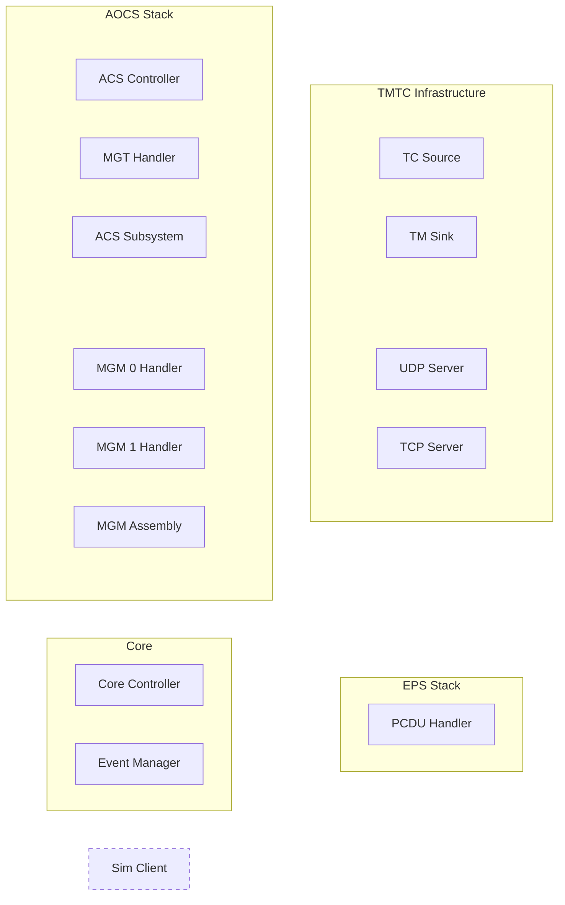

# sat-rs Example Application

The `sat-rs` library includes a monolithic example application which can be found inside
the [`satrs-example`](https://egit.irs.uni-stuttgart.de/rust/sat-rs/src/branch/main/satrs-example)
subdirectory of the repository. The primary purpose of this example application is to show how
the various components of the sat-rs framework could be used as part of a larger on-board
software application.

## Structure of the example project

The example project contains components which could also be expected to be part of a production
On-Board Software. A structural diagram of the example application is given to provide
a brief high-level view of the components used inside the example application:

```mermaid
flowchart TD
    subgraph TMTC[TMTC Infrastructure]
        subgraph TMTCRow1[ ]
            direction LR
            Udp[UDP Server]
            Tcp[TCP Server]
        end
        subgraph TMTCRow2[ ]
            direction LR
            Source[TC Source]
            Sink[TM Sink]
        end
    end

    subgraph AOCS[AOCS Stack]
        subgraph AOCSRow1[ ]
            direction LR
            Mgm0[MGM 0 Handler]
            Mgm1[MGM 1 Handler]
            Assy[MGM Assembly]
        end
        subgraph AOCSRow2[ ]
            direction LR
            AcsCtrl[ACS Controller]
            Mgt[MGT Handler]
            AcsSub[ACS Subsystem]
        end
    end

    subgraph EPS[EPS Stack]
        Pcdu[PCDU Handler]
    end

    subgraph Core[Core]
        direction LR
        Ctrl[Core Controller]
        Evt[Event Manager]
    end

    Sim[Sim Client]:::optional

    TMTC ~~~ EPS
    AOCS ~~~ Core
    Core ~~~ Sim

    classDef optional stroke-dasharray: 5 5;
    classDef invisible fill:none,stroke:none;
    class TMTCRow1,TMTCRow2,AOCSRow1,AOCSRow2 invisible;
```

The dotted lines are used to denote optional components. In this case, the simulation client is
optional because a dummy interface can be used instead to run the example without the simulator.
Some additional explanation is provided for the various components.

### TCP/IP server components

The example includes a UDP and TCP server to receive telecommands and poll telemetry from. This
might be an optional component for an OBSW which is only used during the development phase on
ground. The UDP server is strongly based on the
[UDP TC server](https://docs.rs/satrs/latest/satrs/hal/std/udp_server/struct.UdpTcServer.html).
This server component is wrapped by a TMTC server which handles all telemetry to the last connected
client.

The TCP server is based on the [TCP Spacepacket Server](https://docs.rs/satrs/latest/satrs/hal/std/tcp_server/struct.TcpSpacepacketsServer.html)
class. It parses space packets by using the CCSDS space packet ID as the packet
start delimiter. All available telemetry will be sent back to a client after having read all
telecommands from the client.

### TMTC Infrastructure

The most important components of the TMTC infrastructure include the following components:

- A TC source component which demultiplexes and routes telecommands based on parameters like
  packet APID and a target ID which is part of the packet payload.
- A TM sink sink component which is the target of all sent telemetry and sends it to downlink
   handlers like the UDP and TCP server.

You can read the [Communications chapter](./communication.md) for more
background information on the chosen TMTC infrastructure approach.

## Dataflow

### TMTC component group

This group is the primary interface for clients to communicate with the on-board software
using the combination of CCSDS space packets and `serde` serialized payloads.
In the future, this might be extended with the
[CCSDS File Delivery Protocol](https://public.ccsds.org/Pubs/727x0b5.pdf).

A client can connect to the UDP or TCP server to send telecommands to the on-board software.
These servers forward all telecommands to a centralized TC source component, which demultiplexes
them and routes each one to its target component.

All telemetry generated by the on-board software is sent to a centralized TM sink. The core
controller also forwards events to the event manager, which converts them into telemetry and
sends it to the TM sink as well. The TM sink performs a demultiplexing step to forward all
telemetry to the relevant recipients, which in the example case are the last connected UDP
client and any connected TCP client.

### Application Group

The application group contain some components you might also find in a real satellite software.
This includes an AOCS stack with various device handlers and system level objects.

### Shared components and functional interfaces
