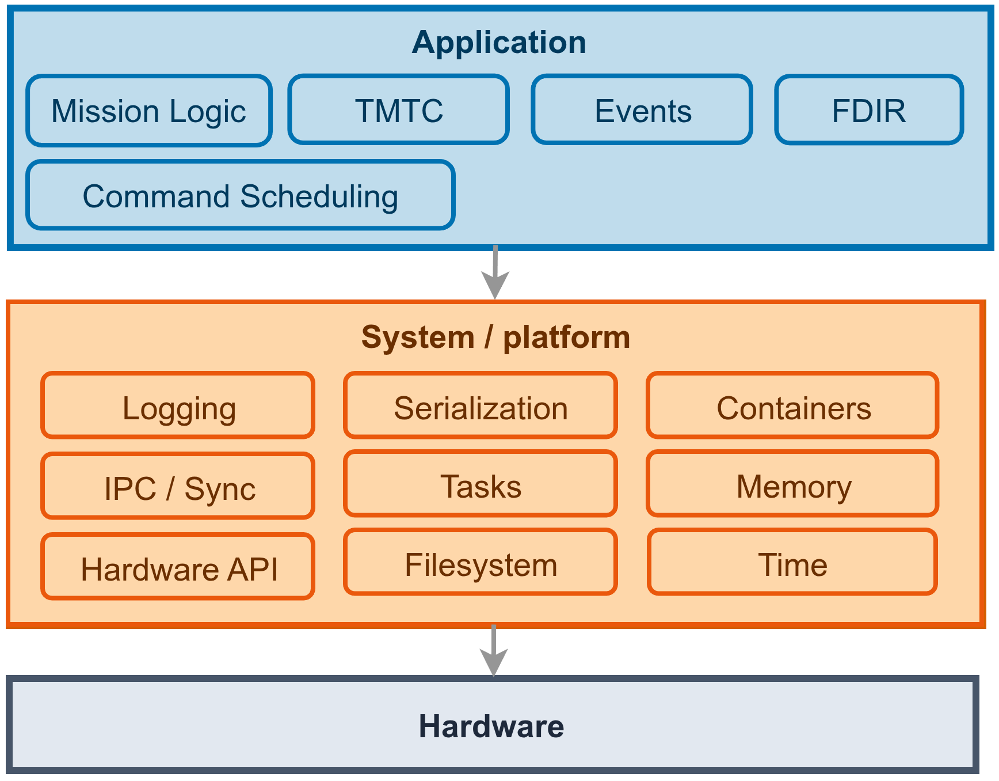
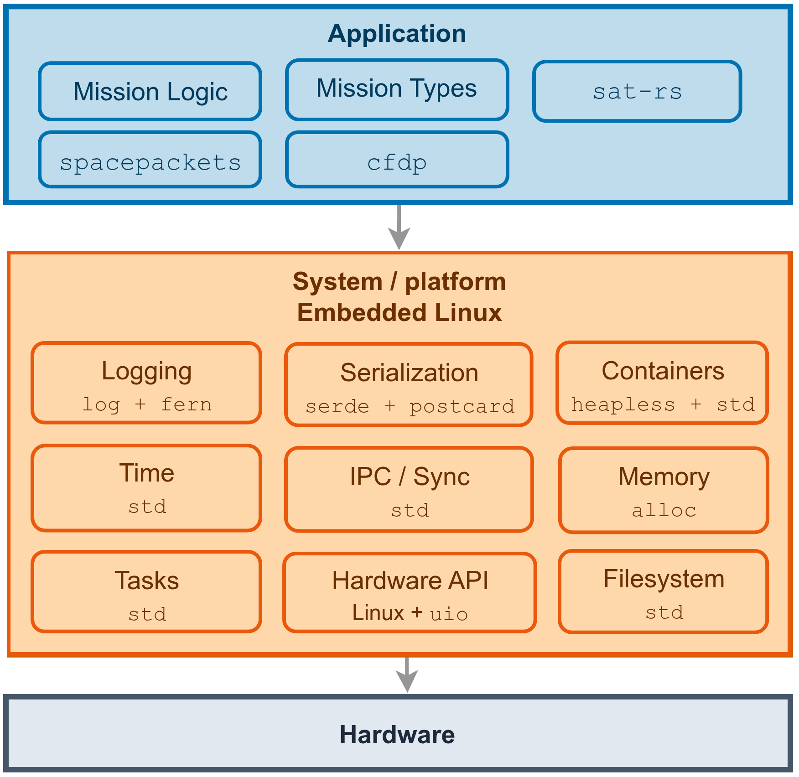
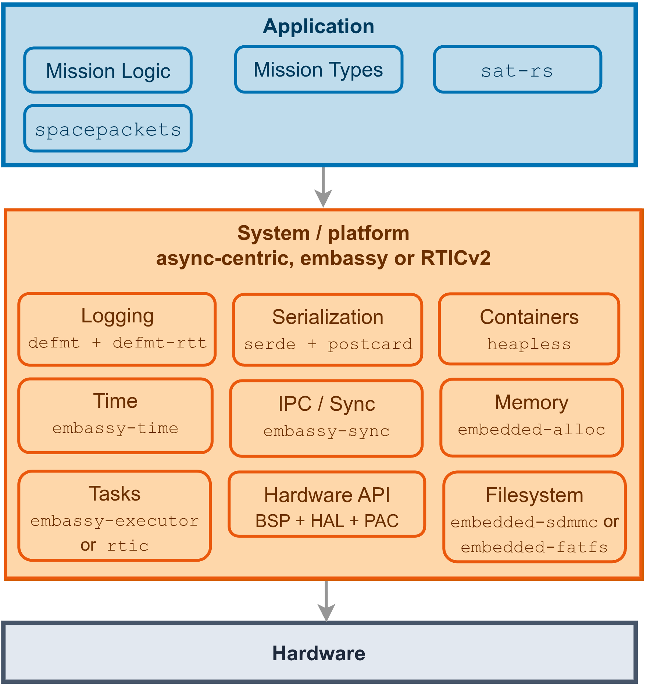

# System View

This chapter gives a system level view of how a typical flight software built with `sat-rs`,
[`spacepackets`](https://egit.irs.uni-stuttgart.de/rust/spacepackets) and
[`cfdp`](https://egit.irs.uni-stuttgart.de/rust/cfdp) is layered. It complements the previous
chapters, which focus on individual components, by showing how those components fit together
and where the line between application and platform is usually drawn.

## Generic layering

Flight software built with `sat-rs` is generally structured into three layers.

- **Application**: The mission specific logic. This is the code a developer writes for a
  particular mission. It covers mission logic, TMTC handling, event handling, FDIR and command
  scheduling. `sat-rs` provides re-usable building blocks for all of these, but the concrete
  wiring and mission behaviour lives here.
- **System / platform**: The set of services the application is built on. This covers
  concepts like logging, serialization, IPC, task and memory management, hardware
  access, filesystem access and time. Most of these components are provided by external libraries
  and APIs.
- **Hardware**: The physical target the software runs on.

The application layer stays largely the same across missions and targets. The system / platform
layer is where the target environment determines which concrete crates and mechanisms are used.

## Embedded Linux

On an embedded Linux target, the platform layer is provided by the Rust standard library and a
small set of additional crates.

The application layer uses `sat-rs` together with `spacepackets` for CCSDS/ECSS packet handling
and `cfdp` for file transfer. The platform layer relies on `std` for tasks, IPC, memory, time and
filesystem access, `serde` and `postcard` for serialization and `log`/`fern` for logging. Hardware
access typically goes through Linux mechanisms like `uio`.

## Embedded async targets (Embassy / RTIC)

On smaller microcontrollers without an operating system, the platform layer looks quite
different, even though the application layer stays the same.

Here the platform layer is built around an async-centric executor, either
[Embassy](https://embassy.dev/) or [RTICv2](https://rtic.rs/). `alloc`-based crates like
`heapless` and `embedded-alloc` replace `std` collections and allocation, `defmt` replaces `log`
for logging and hardware access goes through a board support package (BSP), a hardware
abstraction layer (HAL) and a peripheral access crate (PAC) instead of the OS.
